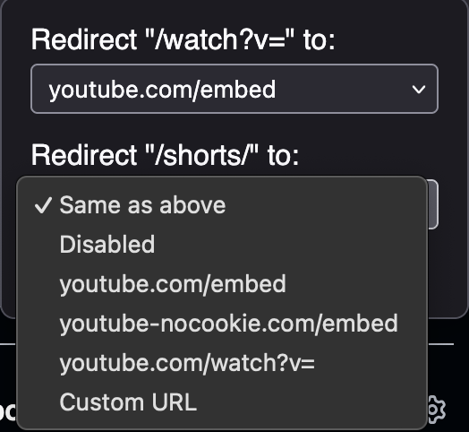

YouTube Embed Redirect
======================

Redirects all YouTube URLs to their embed variant (automatically on visit, no need to click links).

### Install

Install from [Mozilla Addons](https://addons.mozilla.org/en-US/firefox/addon/youtube-embeded-redirect/) or download from [GitHub release](https://github.com/relikd/youtube-embed-redirect/releases/latest) (same xpi as the official website).

### Why?

Mainly because the main YouTube site starts to get unusable.
Videos take a couple of seconds to load – with frequent reloads and sometimes not loading at all (0 min video).
With this extension you get faster loading times and immediate playback.

**Note:**
This extension is built for people who don't like interruptions.
If you use YouTube for other things (comments, related videos), this extension is probably not for you.

### Features

Redirect any `/watch?v=` or `/shorts/` URL to a customizable other URL (`/embed/` by default).

The redirect removes all URL params except `start time` and `playlist`.
This means, playlists will continue playing (and with no delay inbetween).

You can choose to redirect shorts and normal videos to different URLs:

#### Hidden options:

Append `#stay` to any YouTube watch URL to prevent the redirect (once).
This is the same mechanism which allows you to click any link inside of the embeded video to go back to the original page.
